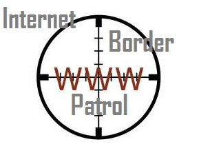
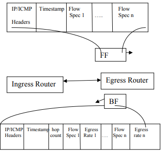

# Internet Border Patrol

> Internet border patrol: preventing congestion collapse and promoting fairness in the Internet.

Internet supports various features such as scalability and that too at a lowest possible cost; a part of this includes congestion control over the internet. Well a variety of congestion control algorithms are available these days but yet prove unworthy in controlling congestions over busy networks. These algorithms are not capable of alone handling congestions over the network. In order to define an efficient algorithm that helps to control any type of network congestions an innovative approach known as internet border patrol would be developed in this project .It controls and monitors various packets and unresponsive data at each border of the network to check for chances of network congestion. This helps preventing congestions over a network. Well to further increase its efficiency, this system is supplemented with enhanced core-stateless fair queuing (ECSFQ) algorithm that allows for even bandwidth flow through resource allocation handling.

## Goals
1. Eliminate congestion collapse resulting from undelivered packets
2. Necessary for discovering source, communicate per-flow bit rates & detect network congestion by estimating RTT
3. Backward feedback packets can be generated asynchronously. (as in Fig.1) (RTT cannot be calculated in this case).

(Fig.1)

__For more information about "Network Border Patrol" and how it works, follow__ [this link.](https://scialert.net/fulltextmobile/?doi=itj.2006.427.432)

*Nourhan Wagdi*
